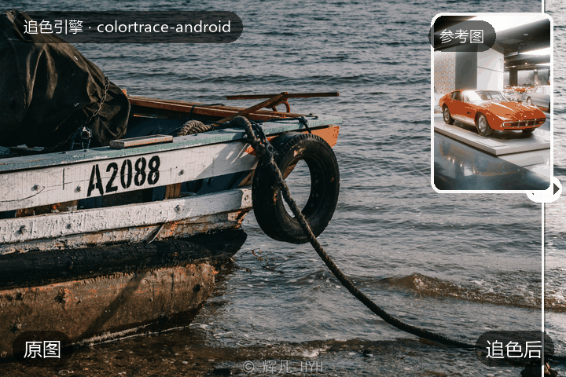

<div align="center">

# colortrace-android · 追色引擎

**把一张参考图的色调、影调，追到你的照片上。**

[](LICENSE)


</div>

桌面端同款引擎的 Kotlin / C++ 移植（桌面端未随本仓库发布），预设文件与桌面端**逐位互通**。

<p align="center">
  
</p>

## 功能

- **三种追色方法**：AI 追色（CNN 编码器）/ 经典统计（LAB Reinhard）/ 影调保真（最优传输）
- **分区保护**：selfie_multiclass 语义分割（皮肤/头发/衣物/背景）+ YuNet 人脸定位，
  人像追色不误伤肤色；任一路径失效自动回退点态色彩域锁定
- **精修**：17 参数 LAB 点态调整（曝光/对比/白平衡/色调色相等）
- **胶片质感**：柔光 / 光晕 / 颗粒三件套，各带独立开关
- **对比画布**：前后分割对比（拖线 1:1 跟手）+ 画布直方图
- **预设库**：设备端 fit 存档 / 导入导出 `.colortrace.json`（与桌面端互通）
- **批量导出**：前台服务 + 通知栏进度 + 断点续传（强杀后接着导）
- **全分辨率导出**：分块管线，60MP 直出；JPEG 4:4:4 流式编码
- **会话恢复**：覆盖安装/进程被杀后从「继续上次编辑」一键重建

## 使用

1. **选参考图**：欢迎屏从相册选一张风格参考图（或打开预设库载入历史预设）
2. **选照片 → 追色**：支持多选，设备端现场拟合
3. **编辑页调整**：强度滑杆、保护模式（关闭 / 肤色锁定 / 分区保护）、正中可换方法、
   精修面板与胶片感页签实时出图
4. **保存** ▾：单张 / 批量 × 原始尺寸 / 预压缩（短边 1920），批量切后台照常跑
5. 左上角 **ⓘ**：使用帮助、关于与诊断、运行日志查看/复制

## 快速开始

### 环境要求

| 组件 | 版本 |
|---|---|
| JDK | 17 |
| Android SDK | compileSdk 34 / minSdk 26 / targetSdk 34 |
| NDK | **27.3.13750724**（写死在 `app/build.gradle.kts`，避免各机器漂移） |
| CMake | 3.22.1（SDK 自带） |
| Gradle | 8.7（wrapper 自带） |
| OpenCV | `org.opencv:opencv:5.0.0`（MavenCentral，自动拉取） |

### 构建

三个 ONNX 模型（约 23MB）已随仓库分发在 `.models/`，克隆即构建，无需下载。

```bash
git clone <本仓库地址>
cd colortrace-android
./gradlew assembleDebug          # Debug APK
./gradlew installDebug           # 装到已连接设备
```

- 推荐 Android Studio 直接打开仓库根目录；命令行构建需先配置
  `ANDROID_SDK_ROOT` 或 `local.properties` 的 `sdk.dir`（后者不入库）。
- 国内网络首次构建慢，可把 `gradle/wrapper/gradle-wrapper.properties` 的
  `distributionUrl` 临时换成镜像源（如腾讯云）。
- native 部分（`app/src/main/cpp/`）为 NEON 优化的 C++ 内核：LAB 色彩转换、
  四区融合、LUT 查表、统计归约——与 Kotlin 实现逐位等价（金标测试保证）。
  ABI 只编 `arm64-v8a`（真机）与 `x86_64`（模拟器）。

### 测试

插桩测试（androidTest）带**金标对拍**：桌面端预先生成的参考输出
（`app/src/androidTest/assets/goldens/`）逐位/带容差比对，覆盖引擎全部模块
（LAB、编码器、统计、分区、胶片、批量、断点续传、会话快照）。

```bash
./gradlew connectedDebugAndroidTest          # 需已连接设备/模拟器
```

## 模型

| 模型 | 大小 | 来源 | 许可 |
|---|---|---|---|
| `encoder_cnn128.onnx` | 6.8MB | 本项目自训（1.71M 参数；训练数据含 DIV2K，限非商用研究） | 见仓库许可 |
| `selfie_multiclass.onnx` | 16.5MB | [MediaPipe selfie_multiclass 的 ONNX 转换](https://huggingface.co/senty-au/selfie_multiclass_256x256-ONNX) | Apache-2.0 |
| `yunet.onnx` | 230KB | [OpenCV Zoo](https://github.com/opencv/opencv_zoo/tree/main/models/face_detection_yunet) | Apache-2.0 |

## 目录结构

```
├── app/src/main/
│   ├── cpp/                    # NDK 内核（C++/NEON，逐位等价 Kotlin 版）
│   ├── java/com/colortrace/
│   │   ├── engine/             # 追色引擎：LAB/编码器/统计/分区/胶片/LUT
│   │   ├── poc/                # 应用层：仓库、批量、预设、快照、分块管线
│   │   └── poc/ui/             # Compose UI（M3 令牌化主题）
│   └── res/
├── app/src/androidTest/        # 插桩测试 + 金标资产（goldens/）
├── .models/                    # 三个 ONNX 模型（随仓库分发，≈23MB）
└── icon/                       # 纯矢量自适应图标（SVG 设计源 + VectorDrawable）
```

## 许可

本项目代码以 **Apache-2.0** 发布（见 [LICENSE](LICENSE)）。随包分发的第三方模型与依赖：
selfie_multiclass（Apache-2.0）· YuNet（Apache-2.0）· OpenCV（Apache-2.0）·
Kotlin/Compose（Apache-2.0）。

## 致谢

- [ColorFM](https://github.com/cszn/ColorFM)（Apache-2.0）—— 自训编码器的架构蓝本
- [MediaPipe selfie_multiclass](https://huggingface.co/senty-au/selfie_multiclass_256x256-ONNX)（Apache-2.0）—— 语义分区随包模型
- [OpenCV Zoo · YuNet](https://github.com/opencv/opencv_zoo)（Apache-2.0）—— 人脸检测权重
